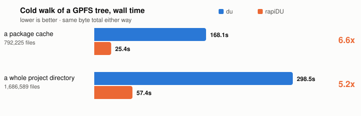

<h1 align="center">rapi<code>DU</code></h1>

<p align="center">
  <strong>A much faster <code>du</code> that tells you why your quota is full.</strong>
</p>

<p align="center">
  <a href="https://github.com/PursuitOfDataScience/rapidu/actions/workflows/ci.yml"></a>
  
  
  
</p>

<p align="center">
  
</p>

```bash
pip install rapidu

rdu ~            # how big is this tree, and what is big inside it
rdu ~ -i         # rank by file count -- what an inode quota actually limits
rdu ~ -c         # count files only, no stat: ~8x again on GPFS
rdu -Q           # the quota table, and the age of its figures
rdu -D           # space held by files deleted while still open
rdu ~ -a         # the full audit: quota + /proc scan + reconciliation
```

Stdlib only, down to the `/usr/bin/python3` that RHEL8 login nodes ship — because
the moment you need this is the moment your home directory is full and `pip`
cannot write to it. `git clone` plus `PYTHONPATH=…/src python3 -m rapidu .` works
with nothing installed at all.

## Faster, and the same number

<p align="center">
  <picture>
    <source media="(prefers-color-scheme: dark)" srcset="assets/benchmark-dark.svg">
    
  </picture>
</p>

A faster answer is only worth having if it is the same answer. On a tree with
hard links, a sparse file and 12-deep nesting, `du -s --block-size=1` and rapiDU
at 1/2/4/8/16 threads all return **655,474,688 B** — a test in this repo, not an
aspiration.

## What rapiDU adds to `du`

- **Why the number is so big.** Files smaller than the allocation unit pay for
  the whole unit, so 3,000 files of 8 KiB hold 23.6 MiB and occupy 187.6 MiB.
- **When the number is still moving.** GPFS does not finalise `st_blocks` for
  tens of seconds; the same tree reads 81 MB after a write and 376 MB settled.
- **How old your quota figure is.** It has been seen 28 minutes stale while a
  512 MiB file was written and deleted without the number moving.
- **Space with no directory entry.** A file unlinked while still open is
  invisible to `ls`, `du` and rapiDU's own walk — but you are charged for it.
- **Where the inodes are.** One conda env is ~177,000 against a 300,000 home
  quota. Inode exhaustion blocks job submission and nobody connects the two.

```
! 187.6 MiB allocated for 23.6 MiB of data — 8.0x. Your quota is charged the first number.
    3,000 files average 8.0 KiB against a 64.0 KiB allocation unit, so they
    occupy 164.1 MiB of padding. Packing them (tar, squashfs) returns it.
```

The allocation unit is **measured**, not assumed: `statvfs` reports the 4 MiB
GPFS *block* where files actually allocate in 16 KiB subblocks.

## Reading the table

```
      size  of tree              share      files  path
 661.5 GiB  █████▋░░░░░░░░░░░░   31.9%        350  checkpoints/
 343.8 GiB  ██▊░░░░░░░░░░░░░░░   16.6%        968  datasets/
 470.9 GiB  ▒▒▒▒▒▒▒▒░░░░░░░░░░   22.9%      4,117  (84 more — use -n 0 for all)
```

The bar is share of the whole tree, so it always agrees with the number beside
it. The hatched row is everything not listed. The column you sorted by is the one
in colour — under `-i`, `files` takes the tone and `size` steps back. Sizes are
cumulative, so any row agrees with `du -s` on that path.

---

Before the run, [`slurmate`](https://github.com/PursuitOfDataScience/slurmate)
builds the request. During it,
[`slurmwatch`](https://github.com/PursuitOfDataScience/slurmwatch) watches. After
it, [`slurmpast`](https://github.com/PursuitOfDataScience/slurmpast) says what
happened. rapiDU is for the storage the whole cycle runs on.

MIT
