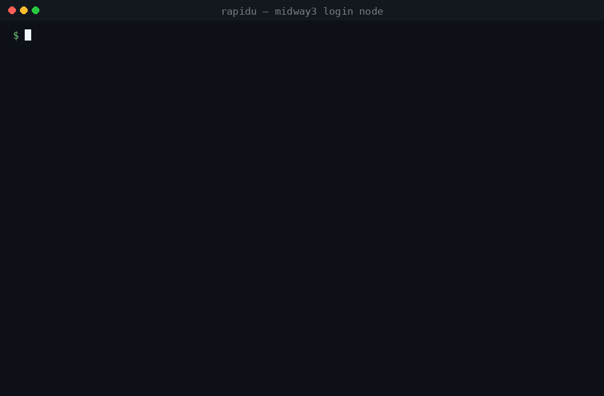

<h1 align="center">rapi<code>DU</code></h1>

<p align="center">
  <strong>A rapid <code>du</code> that tells you <em>why</em>.</strong><br>
  <sub>Where your bytes and inodes went, what <code>du</code> cannot see, and how old the quota number you are arguing with really is.</sub>
</p>

<p align="center">
  <a href="https://github.com/PursuitOfDataScience/rapidu/actions/workflows/ci.yml"></a>
  
  
  
  <a href="https://github.com/astral-sh/ruff"></a>
</p>

<p align="center">
  
</p>

```bash
rdu ~            # how big is this tree, and what is big inside it
rdu ~ -i         # rank by file count -- what an inode quota actually limits
rdu ~ -c         # count files only, no stat: 8x faster
rdu -Q           # the quota table, and the age of its figures
rdu -D           # space held by files that were deleted while still open
rdu ~ -a         # the full audit: quota + /proc scan + reconciliation
```

`rdu --help` for the rest. Stdlib only, down to the `/usr/bin/python3` that RHEL8
login nodes ship — because the moment you need this is the moment your home
directory is full and `pip` cannot write to it.

```bash
git clone https://github.com/PursuitOfDataScience/rapidu    # nothing to install
PYTHONPATH=rapidu/src python3 -m rapidu .

pip install git+https://github.com/PursuitOfDataScience/rapidu   # or packaged
```

---

## It is not more accurate than `du`

A correct walker agrees with `du -s --block-size=1` byte-for-byte, and any claim
to beat it is a bug. On a test tree with hard links, a sparse file and 12-deep
nesting, `du` and rapidu at 1/2/4/8/16 threads all return **655,474,688 B** —
a test in this repo, not an aspiration.

`du` is right about bytes. What it cannot tell you is **when** it is right.

## Five things `du` structurally cannot report

### 1. A freshly written tree has not settled

GPFS does not finalise `st_blocks` for tens of seconds, and it moves in *both*
directions. Measured on Midway3 scratch, 6,000 × 8 KiB files: `du -s` says
**81 MB** immediately after the write and **376 MB** once the tree settles.
Same tree, same command, **4.6x apart** — and nothing in `du`'s output says which
of the two you are holding.

```
  SETTLING
      6,000 files were written in the last 2m 0s
    ! a re-stat 60s later found 255.2 MiB LESS allocated: this tree is still moving.
```

Without `--settle-wait` it calls the figure **provisional** and does *not* claim
it is settled: an immediate re-stat cannot observe an effect that takes tens of
seconds, and a null result from a blind instrument is not evidence.

### 2. Your quota number has an age, and it is usually not now

Quota readings are snapshots. Here `quota` is a site wrapper printing a cached
figure; it has been observed **28 minutes stale, and not refreshing while a
512 MiB file was written, fsync'ed and deleted.** So the age of the *figure* is
printed beside it — and where the backend publishes no timestamp, the age prints
`UNKNOWN`, never "now".

```
QUOTA  snapshot 11m 16s old -- predates anything you just did
  labgroup    blocks   72.1 TiB / 202.3 TiB   ██▌░░░░░░░   35.6%  /project
  otherlab    blocks   11.0 TiB /  11.0 TiB   █████████▉   99.8%  /project
```

### 3. Space held by files that were deleted while still open

A file unlinked while a process holds it open has no directory entry. It is
invisible to `ls`, to `du`, to `ncdu`, and to rapidu's own walk. The blocks
are still allocated, and the quota still charges you for them:

```
$ rdu -D
UNLINKED BUT STILL OPEN
  512.0 MiB held by open file descriptors in 1 inodes
  (invisible to du, to ls, and to this tool's own walk)

      512.0 MiB  pid 802715 python
                 /scratch/midway3/$USER/ckpt-step-4000.bin
```

This is the difference between "my quota says 40 GB and I can only find 12" and
a pid you can go and kill.

### 4. Where the inodes are, which is not where the bytes are

Inode exhaustion silently blocks job submission and nobody connects the two. One
conda env is ~177,000 inodes against a 300,000 soft home quota — two envs
exhaust it. A 64-rank job writes 64 near-empty `rng_state_*.pth` files per
checkpoint, pure inode cost. `rdu -i` ranks by the count instead of the bytes,
and by the **absolute** count: an earlier version ranked by files/GiB, and a
ratio is won by the smallest denominator, so it nominated a 260 KiB `.git`
directory ahead of one holding ten times the inodes.

### 5. Why the number is that big, when the files add up to far less

Every file smaller than the filesystem's allocation unit pays for the whole
unit. On Midway3 scratch that unit is **64 KiB**; on `/home` and `/project` it is
**16 KiB**. So 3,000 files of 8 KiB hold 23.6 MiB and occupy 187.6 MiB, and `du`
reports `188M` with nothing attached to it:

```
 187.6 MiB   /scratch/midway3/$USER/dataset
             3,001 files  ·  3,000 entries  ·  0.01s

! 187.6 MiB allocated for 23.6 MiB of data — 8.0x. Your quota is charged the first number.
    3,000 files average 8.0 KiB against a 64.0 KiB allocation unit, so they
    occupy 164.1 MiB of padding. Packing them (tar, squashfs, a single archive)
    returns it.
```

**The unit is measured, not assumed.** `statvfs` cannot supply it — it reports
the 4 MiB GPFS *block* on `/project` while files actually allocate in 16 KiB
subblocks, a 256x error in the direction that makes small files look free. It is
read off the tree instead, from the allocations the files actually landed on.

It runs the other way too, and that is *not* an error: below ~3.5 KiB GPFS keeps
the data in the inode, so the same filesystem stores 8.7 MiB in 1.6 MiB. There
the report says bytes are nearly free and points at the inode count instead,
because that is the quota that will stop you.

---

## Reading the table

```
      size  of tree              share      files  path
 661.5 GiB  █████▋░░░░░░░░░░░░   31.9%        350  checkpoints/
 593.5 GiB  █████▏░░░░░░░░░░░░   28.6%         36  model-weights/
 343.8 GiB  ██▊░░░░░░░░░░░░░░░   16.6%        968  datasets/
 470.9 GiB  ▒▒▒▒▒▒▒▒░░░░░░░░░░   22.9%      4,117  (84 more — use -n 0 for all)
```

- **The bar is share of the whole tree**, so it always agrees with the `share`
  column beside it. Scaled to the largest row instead — as most disk tools do —
  the top bar is full on every listing ever printed, which tells you nothing and
  contradicts the "31.9%" next to it.
- **The track is the whole tree**, drawn on every row. A bar that trails off into
  blank space reserves the column and draws nothing in most of it, leaving no
  common edge to measure a short bar against.
- **The hatched row is the remainder** — everything not listed, at its true
  length. It is a fifth of this tree, so it is not something to hide, but it is
  many directories rather than one and must not be drawn as though it were one.
- **Colour is rank**, cool to warm, assigned across the listing rather than row
  by row, so two rows share a tone only when they are genuinely the same size.
- **The column you sorted by is the one in colour**, and its header is bold.
  Under `-i` the `files` column takes the tone and `size` steps back, so a
  ranking by inodes cannot be mistaken for a ranking by bytes.
- **`path`, not `directory`**: plain files are ranked here too. Three 63 MiB
  `.db` files in a home directory are a quarter of it.
- Sizes are cumulative subtree totals, so any row agrees with `du -s` on that
  path.

## The reconciliation, and when it refuses to run

The three-way check is `walk + deleted-but-open ≈ quota`. The third term is a
snapshot of unknown age, so a naive version reports a phantom gap and blames an
innocent file descriptor. It is therefore allowed to **refuse** — any of these
turns a difference into `INCONCLUSIVE` rather than a finding:

- the quota snapshot is stale, or published no timestamp at all
- the tree is still settling
- the walk hit unreadable directories, so its total is a floor
- the walk crossed filesystems but the quota governs one
- the walk was `-c`, which never called `stat` and so has no bytes to compare

A gap that survives all of that is reported with **candidate explanations, none
of them asserted** — deleted fds on other nodes, other users' processes an
unprivileged scan cannot inspect, snapshots, replication factor. Walking a
subtree of a larger quota'd tree is reported as a share, not a discrepancy.

## Honest limits

- **Cross-user attribution needs root.** You can read only your own `/proc/*/fd`,
  so in a shared group quota you can prove a gap exists but cannot name the
  labmate holding it. The count of uninspectable processes is printed.
- **The deleted-fd scan is node-local.** A job holding a deleted file on a
  compute node is invisible from the login node.
- **Quota mount mapping is inferred** where the backend does not publish it, and
  ambiguous inferences are dropped rather than guessed.
- **Off-site, fields go absent, not zero** — each prints `n/a` with a reason.

## Speed

**Bytes do not predict how long a walk takes; files do.**

| tree | size | files | `du` |
|---|---|---|---|
| a model cache | 161.7 GiB | 3,286 | 0.44s |
| a package/build cache | 350.0 GiB | 781,772 | 162.25s |

Twice the bytes, **370x the wall time.**

So the speedup is only worth quoting where there is something to wait for. On a
few thousand cached files nothing waits — both tools finish in hundredths of a
second, and rapidu pays 0.03s of interpreter start before it reads a single
directory, which `du` does not. On a tree big enough to make you wait:

| tree, cold | files | `du` | `rdu` | |
|---|---|---|---|---|
| a package cache | 792,225 | 168.08s | 25.40s | **6.6x** |
| a whole project directory | 1,686,589 | 298.46s | 57.43s | **5.2x** |

Measured against itself on those 782k GPFS files, `stat` is 90% of it:

```
scandir + stat (what a sizing walk does)   27.09s     28,900 files/s
scandir alone, no stat                      2.99s    261,800 files/s
this package's own bookkeeping                          +0.5%
```

Both obvious levers are dead ends (`dir_fd` instead of full paths: no
difference; processes instead of threads: **35% worse**, which puts the limit in
the GPFS client per node). **~29,000 stats/s is this filesystem's ceiling.** The
pool caps at 16 and defaults to 8, which is also the polite setting: this walk is
metadata load on a shared filesystem, the exact sin the tool exists to diagnose.

Re-measured on a 1.69M-inode tree, the ceiling holds in every direction:

| | 8 threads | 16 | 32 | 64 | 128 |
|---|---|---|---|---|---|
| wall | 58.3s | 57.7s | 67.2s | 75.7s | 82.0s |

Two processes of 8 threads each move the same total as one — so the cap is the
node, not the GIL. The client's `maxFilesToCache` is **128k against 1.69M
inodes**, which is *why*: the tree is 13x the cache, every walk is cold, and no
amount of concurrency makes a cold GPFS lookup cheaper.

### What the inner loop is still worth

Not the wall clock on a cold tree — but that is not the only tree anyone walks.
The ancestor keys every inode charges are resolved once per directory instead of
rebuilt per file, `S_ISDIR` and the uid/dev tallies are inlined, and
`notify_all` no longer wakes every idle worker on each of ~190k directories:

```
1.69M inodes, cold GPFS   58.5s -> 58.2s    unchanged: the filesystem is the wall
                          CPU 5.0s -> 3.9s  23% less, on a 6-core shared login node
cached trees, 15k-136k inodes               1.09x - 1.16x faster
```

Measured end to end (the whole command, not just the walk), best of nine runs
with the two versions strictly interleaved so both see the same cache state:

| tree | before | after | |
|---|---|---|---|
| 15,644 inodes | 0.119s | 0.105s | 1.14x |
| 33,688 inodes | 0.249s | 0.220s | 1.13x |
| 135,826 inodes | 0.915s | 0.829s | 1.10x |

**So: ~1.1x on anything that fits the client cache, 23% less CPU everywhere, and
identical output** — byte-for-byte against `du` and against the previous walker
across 48 tree/depth/mode combinations. The CPU figure is the one that matters on
a login node you are sharing with a dozen people.

The one real speedup is not calling `stat` at all — `d_type` from `getdents`
already separates directories from everything else, which is all a count needs.
`rdu -c` measured **8x** faster on both a 782k-file tree (27.3s → 3.4s) and a
1.7M-file one (55s → 6.9s).

> **Prior art, stated because it is owed.** The `du` comparison is against a
> single-threaded 1971 program — *not* the state of the art. Parallel walkers
> exist (`dust`, `gdu`, `diskus`, `duc`) and, given the ceiling above, any of
> them will land within a few percent on the same filesystem. **Speed is table
> stakes here; the quota-age, settling and deleted-fd reporting are the product.**

## Behaviour worth knowing

The only positional argument is a path. Modes are flags, not subcommands:
`quota`, `walk` and `deleted` are all ordinary directory names, so `rdu deleted`
must mean "measure ./deleted" and nothing else.

Colour is off unless stdout is a terminal, honours `NO_COLOR`, and degrades from
256 colours to 8 and from block glyphs to ASCII when the terminal says so. A long
walk paints a spinner on **stderr**, so a redirected report stays clean.
**Ctrl+C** prints the subtrees that finished and says plainly that the rest is
unknown, rather than ranking a half-counted tree. Exit codes: `0` clean, `1`
something needs a human (incomplete walk, drifting tree, unexplained gap), `2`
error.

## Tests

```bash
pip install -e ".[dev]" && pytest
```

The suite pins the invariants that decide whether this is better or worse than
`du`: byte-exact agreement, identical results across thread counts, hard-link
dedup, sparse files not over-counted, the thread cap, that the package still
parses under Python 3.6 — and, most of the reconciliation tests, the refusals.
The README GIF is generated from real CLI output by
[`assets/render_demo.py`](assets/render_demo.py); nothing in it is hand-typed.

---

Before the run, [`slurmate`](https://github.com/PursuitOfDataScience/slurmate)
builds the request. During it,
[`slurmwatch`](https://github.com/PursuitOfDataScience/slurmwatch) watches.
After it, [`slurmpast`](https://github.com/PursuitOfDataScience/slurmpast) says
what happened. `rapidu` is for the storage the whole cycle runs on.

MIT
